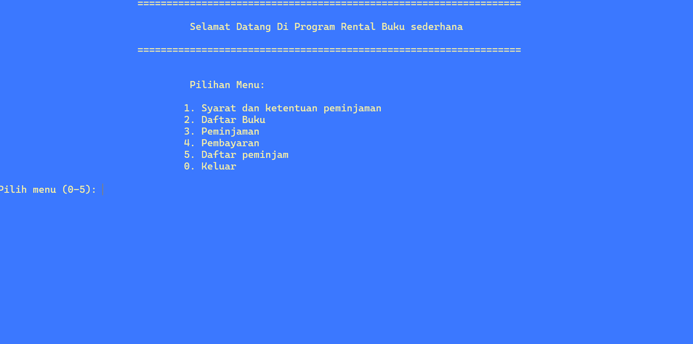

# Rental Buku – Final Project

Program sederhana **Book Rental System** dibuat dengan bahasa **C++** sebagai tugas akhir.  
Aplikasi ini mensimulasikan sistem rental buku dengan fitur peminjaman, pembayaran, dan pencatatan data peminjam.

---

## 📖 Fitur Utama
- Menampilkan daftar buku lengkap (judul, pengarang, harga sewa per hari).
- Peminjaman buku dengan input nama, tanggal pinjam, dan lama pinjam.
- Perhitungan total biaya peminjaman.
- Penyimpanan data peminjam ke file `peminjam.txt`.
- Menampilkan daftar riwayat peminjam.
- Pengurutan daftar buku menggunakan **Bubble Sort**.
- Menggunakan **Linked List** dan **Stack** untuk pengelolaan data.

---

## 🛠️ Teknologi yang Digunakan
- **Bahasa:** C++  
- **Struktur Data:** Linked List, Stack  
- **File Handling:** Input/Output File (`fstream`)  
- **Lingkungan:** CLI (Command Line Interface)

---

## 📸 Screenshot
Berikut contoh tampilan program saat dijalankan:



---

## 🚀 Cara Menjalankan

### 1. Clone Repository
```bash
git clone https://github.com/USERNAME/rental-buku-cpp.git
cd rental-buku-cpp
